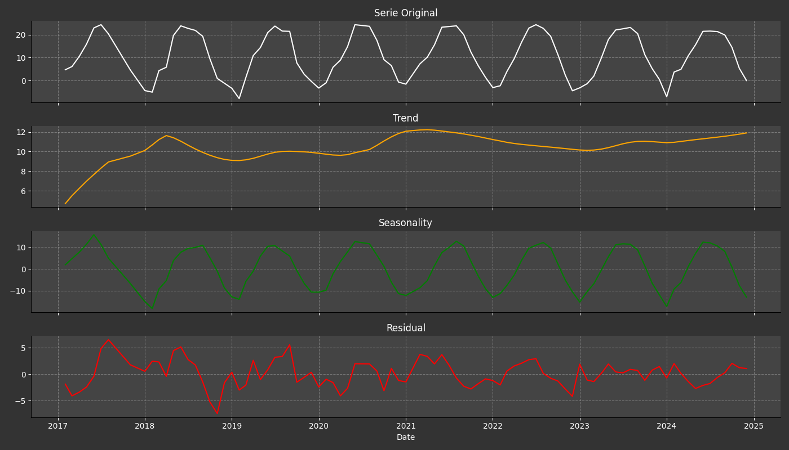

# Exploratory Data Analysis Report

## Overview
This report analyzes the dataset from NOAA for station **GHCND:MXM00076679** from **2005-01-01** to **2024-12-31**.

---

## Summary Statistics

|       |   AverageTemperature |
|:------|---------------------:|
| count |             90       |
| mean  |             10.8278  |
| std   |              9.80021 |
| min   |             -7.9     |
| 25%   |              2.475   |
| 50%   |             10.4     |
| 75%   |             20.875   |
| max   |             24.4     |

---

## Levene's Test (Variance Homogeneity)

- Statistic: **0.043**
- p-value: **1.0**

✅ No significant difference in variances.

---

## ADF Test (Stationarity)

- ADF Statistic: **-8.915**
- p-value: **0.0**
- Critical values:  
1%: -3.510
5%: -2.896
10%: -2.585

✅ The series is stationary.

---

## Time Series

---

## Time Series Decomposition

---

## Conclusion

Based on the analysis, we observe seasonal trends and moderate stationarity after differencing.
