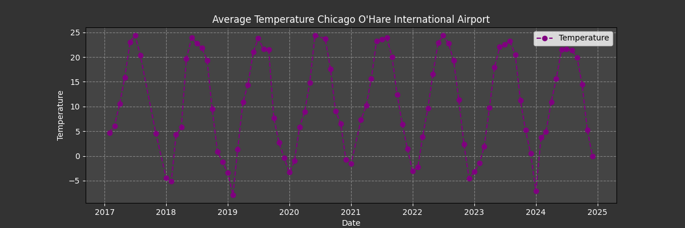

# Residuals diagnostics Report

## Overview
This report analyzes the residuals of models of dataset from NOAA for station **{{ station_id }}** from **{{ start_date }}** to **{{ end_date }}**.

---

## Models candidate and Justification

{{ models_candidates }}

{{ justification }}

---

## Residuals close to zero (mean = 0)

- Statistic: **{{ levene_stat }}**
- p-value: **{{ levene_pval }}**


⚠️ Variances are significantly different.

✅ No significant difference in variances.


---

## ADF Test (Stationarity)

- ADF Statistic: **{{ adf_stat }}**
- p-value: **{{ adf_pval }}**
- Critical values:  
{{ adf_crit_vals }}


✅ The series is stationary.

⚠️ The series is non-stationary.


---

## Time Series

---

## Time Series Decomposition

---

## Conclusion

Based on the analysis, we observe {{ conclusion }}.