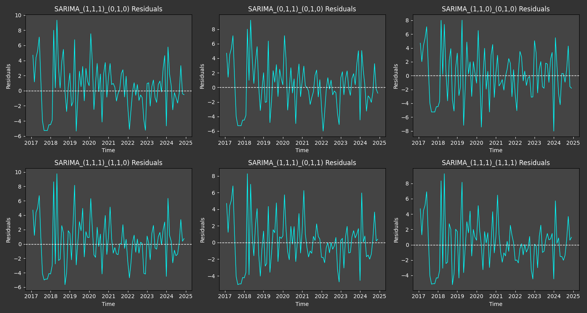
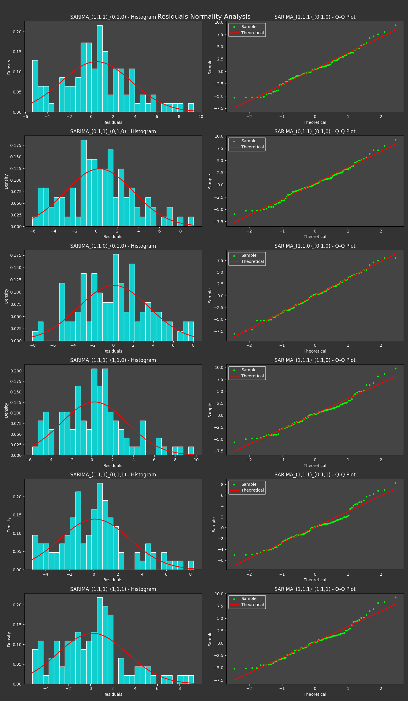
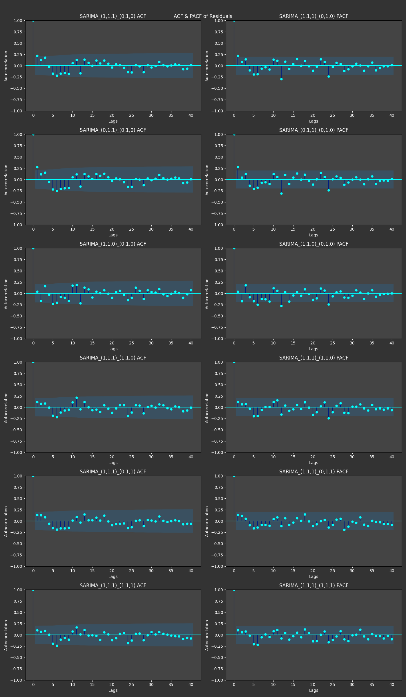
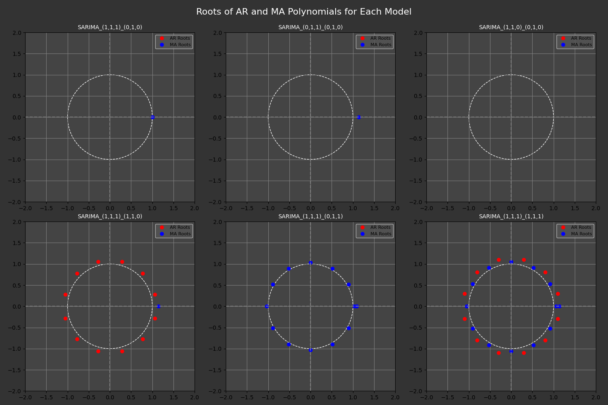

# Residual Diagnostics Report

## Residual Mean Test (t-test)
| Model                  |      Mean |     Std |   t-stat |   p-value | Status                       |
|:-----------------------|----------:|--------:|---------:|----------:|:-----------------------------|
| SARIMA_(1,1,1)_(0,1,0) | 0.484532  | 3.20428 | 1.47385  |  0.143863 | ✅ Mean ≈ 0 (good residuals) |
| SARIMA_(0,1,1)_(0,1,0) | 0.31783   | 3.23176 | 0.958558 |  0.34024  | ✅ Mean ≈ 0 (good residuals) |
| SARIMA_(1,1,0)_(0,1,0) | 0.0589415 | 3.53648 | 0.162447 |  0.871302 | ✅ Mean ≈ 0 (good residuals) |
| SARIMA_(1,1,1)_(1,1,0) | 0.259777  | 3.1797  | 0.7963   |  0.427864 | ✅ Mean ≈ 0 (good residuals) |
| SARIMA_(1,1,1)_(0,1,1) | 0.0941884 | 2.89647 | 0.31695  |  0.751984 | ✅ Mean ≈ 0 (good residuals) |
| SARIMA_(1,1,1)_(1,1,1) | 0.188515  | 3.1331  | 0.586454 |  0.558976 | ✅ Mean ≈ 0 (good residuals) |

## Normality (Anderson-Darling Test)
| Model                  |   AD Statistic |   Critical Value (5%) | Status           |
|:-----------------------|---------------:|----------------------:|:-----------------|
| SARIMA_(1,1,1)_(0,1,0) |       0.447269 |                 0.757 | ✅ Normality     |
| SARIMA_(0,1,1)_(0,1,0) |       0.341587 |                 0.757 | ✅ Normality     |
| SARIMA_(1,1,0)_(0,1,0) |       0.143039 |                 0.757 | ✅ Normality     |
| SARIMA_(1,1,1)_(1,1,0) |       0.659733 |                 0.757 | ✅ Normality     |
| SARIMA_(1,1,1)_(0,1,1) |       0.967741 |                 0.757 | ❌ Non-normality |
| SARIMA_(1,1,1)_(1,1,1) |       0.76498  |                 0.757 | ❌ Non-normality |

## Autocorrelation (Ljung-Box Test)
| Model                  |   Ljung-Box p-value | Status                |
|:-----------------------|--------------------:|:----------------------|
| SARIMA_(1,1,1)_(0,1,0) |           0.114037  | ✅ No autocorrelation |
| SARIMA_(0,1,1)_(0,1,0) |           0.0247356 | ❌ Autocorrelation    |
| SARIMA_(1,1,0)_(0,1,0) |           0.0781523 | ✅ No autocorrelation |
| SARIMA_(1,1,1)_(1,1,0) |           0.517598  | ✅ No autocorrelation |
| SARIMA_(1,1,1)_(0,1,1) |           0.588373  | ✅ No autocorrelation |
| SARIMA_(1,1,1)_(1,1,1) |           0.610991  | ✅ No autocorrelation |

## Heteroscedasticity (White Test)
| Model                  |   LM Statistic |   LM p-value |   F Statistic |   F p-value | Status                |
|:-----------------------|---------------:|-------------:|--------------:|------------:|:----------------------|
| SARIMA_(1,1,1)_(0,1,0) |       11.2596  |   0.0237966  |       3.02531 |  0.0216852  | ❌ Heteroscedasticity |
| SARIMA_(0,1,1)_(0,1,0) |        9.54086 |   0.0489144  |       2.51195 |  0.0471476  | ❌ Heteroscedasticity |
| SARIMA_(1,1,0)_(0,1,0) |        6.442   |   0.168482   |       1.63672 |  0.17191    | ✅ Homoscedasticity   |
| SARIMA_(1,1,1)_(1,1,0) |        8.08597 |   0.0884793  |       2.09327 |  0.0881957  | ✅ Homoscedasticity   |
| SARIMA_(1,1,1)_(0,1,1) |       13.7841  |   0.00801692 |       3.81874 |  0.00650186 | ❌ Heteroscedasticity |
| SARIMA_(1,1,1)_(1,1,1) |        8.96672 |   0.0619366  |       2.34504 |  0.060586   | ✅ Homoscedasticity   |
## Stationarity and Invertibility (Roots of AR/MA Polynomials)
| Model                  | Stationary   | Invertible   |
|:-----------------------|:-------------|:-------------|
| SARIMA_(1,1,1)_(0,1,0) | True         | False        |
| SARIMA_(0,1,1)_(0,1,0) | True         | True         |
| SARIMA_(1,1,0)_(0,1,0) | True         | True         |
| SARIMA_(1,1,1)_(1,1,0) | True         | True         |
| SARIMA_(1,1,1)_(0,1,1) | True         | True         |
| SARIMA_(1,1,1)_(1,1,1) | True         | True         |

## Outlier Detection (Grubbs & IQR)
| Model                  | Grubbs   |   Grubbs_Stat |   Grubbs_Crit |   IQR_Outliers |
|:-----------------------|:---------|--------------:|--------------:|---------------:|
| SARIMA_(1,1,1)_(0,1,0) | ✅ None  |         2.761 |         3.366 |              2 |
| SARIMA_(0,1,1)_(0,1,0) | ✅ None  |         2.76  |         3.366 |              2 |
| SARIMA_(1,1,0)_(0,1,0) | ✅ None  |         2.287 |         3.366 |              0 |
| SARIMA_(1,1,1)_(1,1,0) | ✅ None  |         2.986 |         3.366 |              3 |
| SARIMA_(1,1,1)_(0,1,1) | ✅ None  |         2.82  |         3.366 |              4 |
| SARIMA_(1,1,1)_(1,1,1) | ✅ None  |         2.897 |         3.366 |              4 |

---
*Generated with Python & Statsmodels. Analyst: Your Name.*
